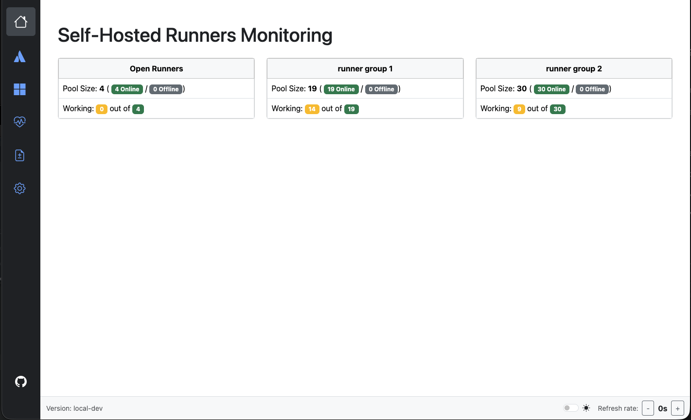
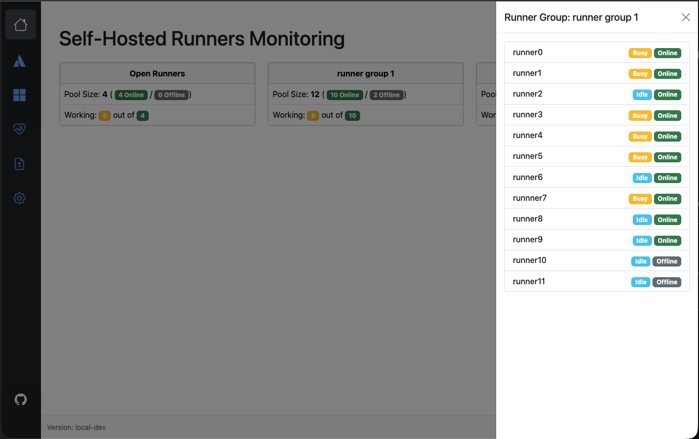
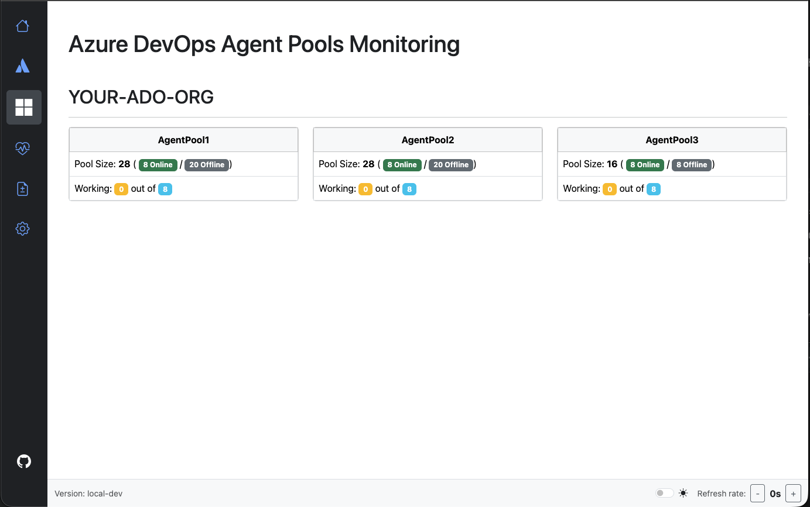
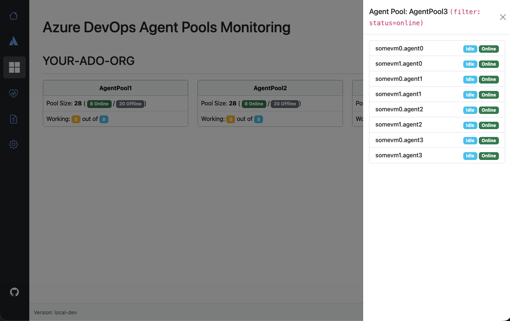
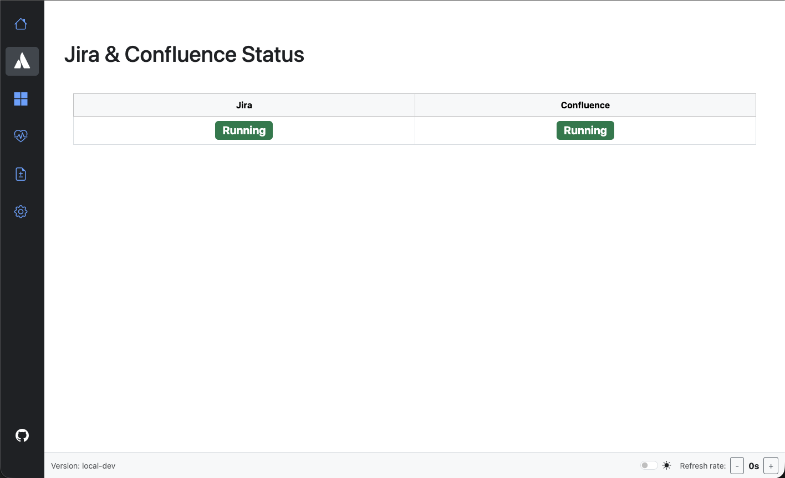
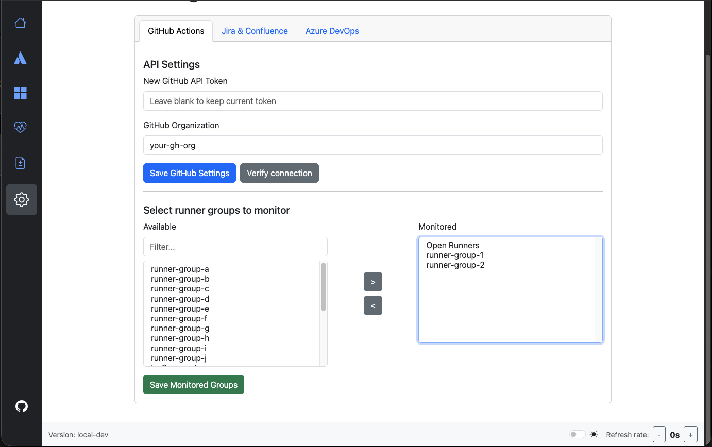
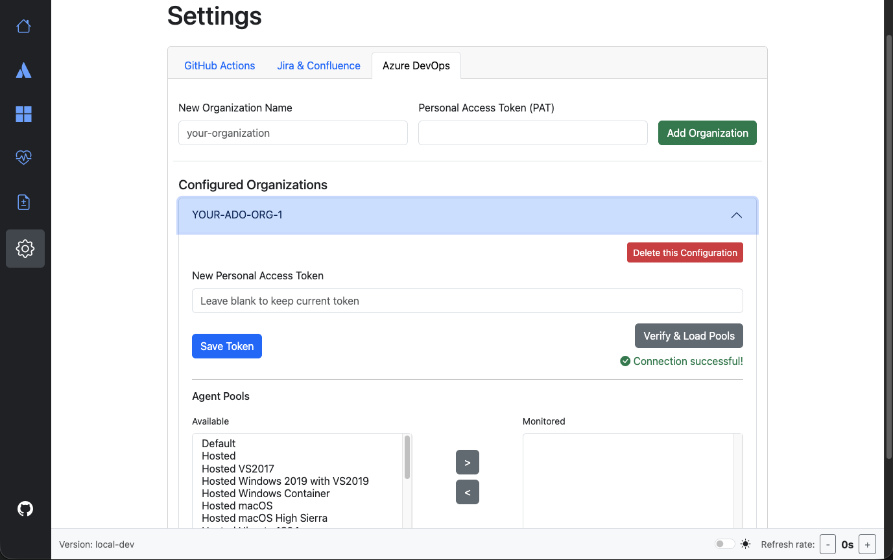
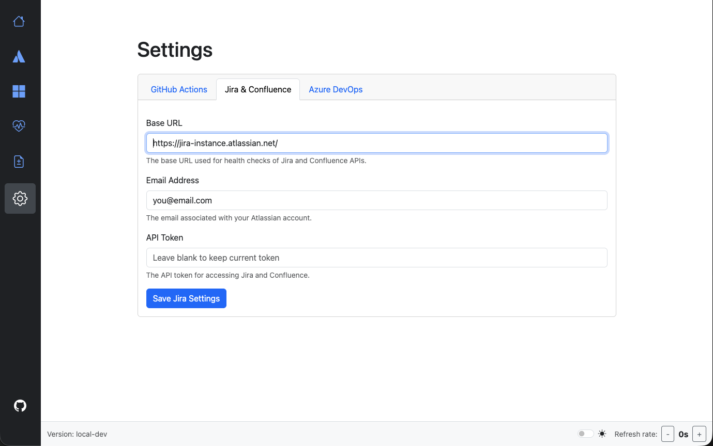
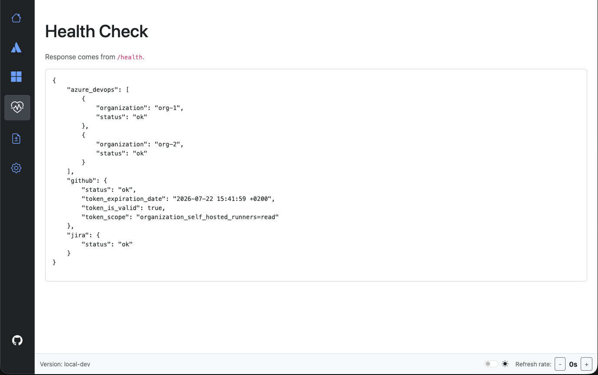

<div align="center">

# 🎯 Self-Hosted Runners Monitoring Dashboard

[](https://www.python.org/downloads/)
[](https://www.docker.com/)
[](LICENSE)

**A unified monitoring dashboard for GitHub Actions runners, Azure DevOps agents, and Atlassian services**

[Features](#-features) • [Screenshots](#-screenshots) • [Quick Start](#-quick-start) • [Documentation](#-documentation)

</div>

---

## 📖 Table of Contents

- [Features](#-features)
- [Screenshots](#-screenshots)
- [Quick Start](#-quick-start)
- [Prerequisites](#-prerequisites)
- [Installation](#-installation)
  - [Local Development](#local-development)
  - [Docker Deployment](#docker-deployment)
  - [Kubernetes Deployment](#kubernetes-deployment)
- [Configuration](#-configuration)
- [API Tokens](#-api-tokens)
- [Development](#-development)
- [Contributing](#-contributing)
- [License](#-license)

---

## ✨ Features

- 🔄 **GitHub Actions Monitoring** - Track self-hosted runners status (Online, Offline, Busy)
- 🔵 **Azure DevOps Integration** - Monitor agent pools across multiple organizations
- 📊 **Atlassian Health Checks** - API status monitoring for Jira & Confluence
- 🔐 **Token Management** - Verify expiration dates and scopes for API tokens
- 🏥 **Health Dashboard** - Centralized health check for all integrated services
- 🔒 **Secure by Design** - Encrypted credentials storage, non-root containers
- 🎨 **Modern UI** - Responsive Bootstrap interface with real-time updates

---

## 📸 Screenshots

<details open>
<summary><b>GitHub Actions Runners</b></summary>


*Overview of self-hosted runners status*


*Detailed runner information*
</details>

<details>
<summary><b>Azure DevOps Agents</b></summary>


*Agent pools monitoring*


*Agent pool details*
</details>

<details>
<summary><b>Jira & Confluence</b></summary>


*Atlassian services health check*
</details>

<details>
<summary><b>Settings & Configuration</b></summary>


*GitHub Actions configuration*


*Azure DevOps configuration*


*Jira & Confluence configuration*
</details>

<details>
<summary><b>Health Check Dashboard</b></summary>


*Centralized health monitoring*
</details>

---

## 🚀 Quick Start

Get up and running in under 5 minutes with Docker:

```bash
# Clone the repository
git clone git@github.com:szulawski/monitoring-dashboard.git
cd monitoring-dashboard

# Generate required keys
export SECRET_KEY=$(python3 -c 'import secrets; print(secrets.token_hex(32))')
export ENCRYPTION_KEY=$(python3 generate_key.py)

# Create instance directory for database
mkdir -p local_instance

# Build and run with Docker
docker build -t monitoring-dashboard:latest .
docker run -d -p 8000:8000 \
  -e SECRET_KEY="$SECRET_KEY" \
  -e ENCRYPTION_KEY="$ENCRYPTION_KEY" \
  -v "$(pwd)/local_instance:/app/instance" \
  --name monitoring-dashboard \
  monitoring-dashboard:latest

# Access the dashboard
open http://localhost:8000
```

---

## 📋 Prerequisites

### System Requirements

| Component | Minimum Version | Recommended |
|-----------|----------------|-------------|
| Python | 3.12+ | 3.12+ |
| Docker | 20.10+ | Latest |
| RAM | 512MB | 1GB+ |
| Disk | 500MB | 1GB+ |

### Required Tools

- **Python 3.12+** - Application runtime
- **Docker** (optional) - For containerized deployment
- **Git** - Version control

**Optional:**
- `pyenv` - Python version management
- `colima` - Docker Desktop alternative (macOS)

---

## 🛠️ Installation

### Local Development

**1. Clone the repository**

```bash
git clone git@github.com:szulawski/monitoring-dashboard.git
cd monitoring-dashboard
```

**2. Create virtual environment**

```bash
python3 -m venv .venv
source .venv/bin/activate  # On Windows: .venv\Scripts\activate
pip install --upgrade pip
pip install -r requirements.txt
```

**3. Generate security keys**

```bash
# Generate SECRET_KEY
python3 -c 'import secrets; print(secrets.token_hex(32))'

# Generate ENCRYPTION_KEY
python3 generate_key.py
```

**4. Configure environment**

```bash
cp dotenv.example .env
# Edit .env and add your SECRET_KEY and ENCRYPTION_KEY
```

**5. Initialize database**

```bash
export FLASK_APP=run.py
flask db upgrade
```

**6. Run tests (optional)**

```bash
pytest
```

**7. Start the application**

```bash
gunicorn --workers 1 --bind 0.0.0.0:8000 run:app
```

Navigate to `http://localhost:8000` and create your admin account.

---

### Docker Deployment

**Build the image:**

```bash
docker build -t monitoring-dashboard:latest .
```

**Run the container:**

```bash
# Generate keys
export SECRET_KEY=$(python3 -c 'import secrets; print(secrets.token_hex(32))')
export ENCRYPTION_KEY=$(python3 generate_key.py)

# Create instance directory
mkdir -p local_instance

# Run container
docker run -d -p 8000:8000 \
  -e SECRET_KEY="$SECRET_KEY" \
  -e ENCRYPTION_KEY="$ENCRYPTION_KEY" \
  -v "$(pwd)/local_instance:/app/instance" \
  --name monitoring-dashboard \
  monitoring-dashboard:latest
```

**Container management:**

```bash
# View logs
docker logs -f monitoring-dashboard

# Stop container
docker stop monitoring-dashboard

# Remove container
docker rm monitoring-dashboard
```

---

### Kubernetes Deployment

Production-ready Kubernetes manifests are provided in the `k8s/` directory with full documentation.

**Quick deploy:**

```bash
# 1. Generate security keys
export SECRET_KEY=$(python3 -c 'import secrets; print(secrets.token_hex(32))')
export ENCRYPTION_KEY=$(python3 generate_key.py)

# 2. Update secret.yaml with generated values
cd k8s
sed -i.bak "s/REPLACE_WITH_YOUR_SECRET_KEY/$SECRET_KEY/g" secret.yaml
sed -i.bak "s/REPLACE_WITH_YOUR_ENCRYPTION_KEY/$ENCRYPTION_KEY/g" secret.yaml

# 3. Deploy all resources
kubectl apply -f .

# 4. Verify deployment
kubectl get all -n monitoring-dashboard
kubectl logs -f deployment/monitoring-dashboard -n monitoring-dashboard

# 5. Access the application
kubectl port-forward svc/monitoring-dashboard 8000:80 -n monitoring-dashboard
```

**Using Kustomize:**

```bash
# Configure secrets in k8s/secret.yaml first, then:
kubectl apply -k k8s/
```

**What's included:**
- ✅ Namespace isolation
- ✅ ConfigMap for configuration
- ✅ Secrets for sensitive data
- ✅ PersistentVolumeClaim for database
- ✅ Deployment with health checks & resource limits
- ✅ ClusterIP Service with session affinity
- ✅ Optional Ingress for external access
- ✅ Security contexts (non-root, capabilities dropped)
- ✅ Kustomize support

📖 **Full documentation:** See [`k8s/README.md`](k8s/README.md) for detailed configuration and production considerations.

---

## ⚙️ Configuration

### Environment Variables

| Variable | Description | Required | Default |
|----------|-------------|----------|---------|
| `SECRET_KEY` | Flask session secret | ✅ | - |
| `ENCRYPTION_KEY` | Credential encryption key | ✅ | - |
| `REFRESH_INTERVAL_SECONDS` | Dashboard refresh interval | ❌ | `30` |
| `DATABASE_URL` | Database connection string | ❌ | `sqlite:///instance/database.db` |

### First-Time Setup

1. Navigate to `http://localhost:8000`
2. Create admin account at `/setup`
3. Log in and configure API tokens at `/settings`
4. Select runner groups/agent pools to monitor

---

## 🔑 API Tokens

Configure API tokens in the `/settings` page after initial setup.

### GitHub Personal Access Token (Fine-Grained)

**Purpose:** Access GitHub API to retrieve runner information

**Required Permissions:**
- `organization:administration` (Read-only) - Access GitHub-hosted runners
- `organization:self-hosted runners` (Read-only) - Access self-hosted runners

[Create Token →](https://github.com/settings/tokens?type=beta)

---

### Atlassian API Token

**Purpose:** Monitor Jira & Confluence API health

**Requirements:**
- Active license for both Jira and Confluence
- Valid email associated with Atlassian account

[Create Token →](https://id.atlassian.com/manage-profile/security/api-tokens)

---

### Azure DevOps Personal Access Token

**Purpose:** Access Azure DevOps API for agent pool monitoring

**Required Scopes:**
- `Agent Pools` (Read & manage) - Read pools and agent status
- `Build` (Read) - Check if agents are busy
- `Project and Team` (Read) - Connection verification

[Create Token →](https://dev.azure.com/_usersSettings/tokens)

---

## 💻 Development

### Running Tests

```bash
# Run all tests
pytest

# Run with coverage
pytest --cov=app --cov-report=html

# Run specific test file
pytest tests/test_app.py
```

### Project Structure

```
monitoring-dashboard/
├── app/
│   ├── controllers/      # Flask routes and business logic
│   ├── static/          # CSS, images, JS
│   ├── templates/       # Jinja2 HTML templates
│   ├── models.py        # SQLAlchemy models
│   ├── forms.py         # WTForms definitions
│   └── utils.py         # Helper functions
├── migrations/          # Alembic database migrations
├── tests/              # Pytest test suite
├── k8s/                # Kubernetes manifests
├── docs/               # Documentation and screenshots
├── Dockerfile          # Container image definition
└── requirements.txt    # Python dependencies
```

### Adding New Features

1. Create feature branch: `git checkout -b feature/my-feature`
2. Make changes and add tests
3. Run tests: `pytest`
4. Commit changes: `git commit -am 'Add my feature'`
5. Push branch: `git push origin feature/my-feature`
6. Create Pull Request

---

## 📚 Additional Resources

### OS-Specific Setup Guides

<details>
<summary><b>macOS Setup (Homebrew + Colima)</b></summary>

```bash
# Install Homebrew
/bin/bash -c "$(curl -fsSL https://raw.githubusercontent.com/Homebrew/install/HEAD/install.sh)"

# Install Python and pyenv
brew install python pyenv

# Configure pyenv
echo 'export PYENV_ROOT="$HOME/.pyenv"' >> ~/.zshrc
echo 'export PATH="$PYENV_ROOT/bin:$PATH"' >> ~/.zshrc
echo 'eval "$(pyenv init --path)"' >> ~/.zshrc
source ~/.zshrc

# Install Python 3.12
pyenv install 3.12

# Install Docker with Colima (free alternative to Docker Desktop)
brew install docker docker-credential-helper colima

# Configure Docker for Colima
cat > ~/.docker/config.json << EOF
{
  "auths": {},
  "credsStore": "osxkeychain",
  "currentContext": "colima"
}
EOF

# Start Colima
colima start

# Verify Docker is running
docker context ls
```
</details>

<details>
<summary><b>Ubuntu Linux Setup</b></summary>

```bash
# Update system
sudo apt update && sudo apt upgrade -y

# Install Python 3.12
sudo apt install software-properties-common -y
sudo add-apt-repository ppa:deadsnakes/ppa -y
sudo apt update
sudo apt install python3.12 python3.12-venv python3-pip -y

# Install Docker
sudo apt install apt-transport-https ca-certificates curl software-properties-common -y
curl -fsSL https://download.docker.com/linux/ubuntu/gpg | sudo gpg --dearmor -o /usr/share/keyrings/docker-archive-keyring.gpg
echo "deb [arch=$(dpkg --print-architecture) signed-by=/usr/share/keyrings/docker-archive-keyring.gpg] https://download.docker.com/linux/ubuntu $(lsb_release -cs) stable" | sudo tee /etc/apt/sources.list.d/docker.list > /dev/null
sudo apt update
sudo apt install docker-ce docker-ce-cli containerd.io docker-buildx-plugin docker-compose-plugin -y

# Start Docker service
sudo systemctl enable docker
sudo systemctl start docker

# Add user to docker group (optional - avoid sudo)
sudo usermod -aG docker $USER
newgrp docker

# Verify installation
docker --version
python3.12 --version
```
</details>

---

## 🤝 Contributing

Contributions are welcome! Please feel free to submit a Pull Request.

1. Fork the repository
2. Create your feature branch
3. Commit your changes
4. Push to the branch
5. Open a Pull Request

---

## 📄 License

This project is licensed under the MIT License - see the [LICENSE](LICENSE) file for details.

---

## 🙏 Acknowledgments

Built with:
- [Flask](https://flask.palletsprojects.com/) - Web framework
- [Bootstrap 5](https://getbootstrap.com/) - UI framework
- [SQLAlchemy](https://www.sqlalchemy.org/) - ORM
- [Gunicorn](https://gunicorn.org/) - WSGI server

---

<div align="center">

**[⬆ Back to Top](#-self-hosted-runners-monitoring-dashboard)**

Made with ❤️ by Piotr Szulawski

</div>

